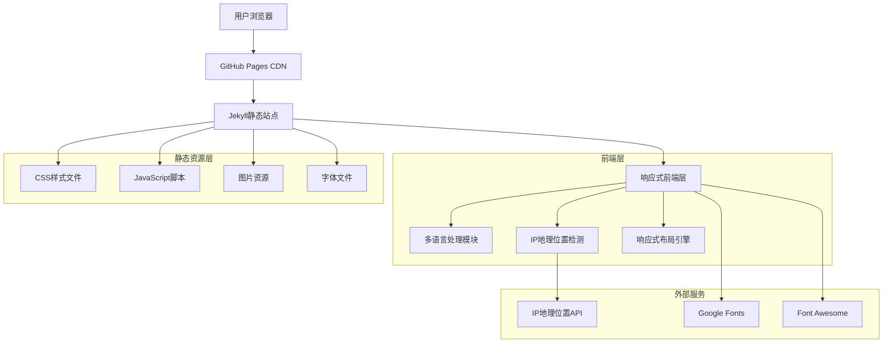

# Jekyll博客技术架构文档

## 1. 架构设计



## 2. 技术描述

* **前端框架**: Jekyll\@4.3 + Liquid模板引擎

* **CSS框架**: Bootstrap\@3.4 + 自定义响应式CSS

* **JavaScript库**: jQuery\@3.6 + 原生ES6+模块

* **构建工具**: Jekyll内置构建 + Grunt\@1.5（可选）

* **样式预处理**: LESS\@4.1

* **托管平台**: GitHub Pages

* **CDN**: Cloudflare

## 3. 路由定义

| 路由                              | 用途               |
| ------------------------------- | ---------------- |
| /                               | 首页，显示文章列表和导航     |
| /about                          | 关于页面，个人介绍和联系方式   |
| /archive                        | 归档页面，按时间和标签分类的文章 |
| /search                         | 搜索页面，全文搜索功能      |
| /portfolio                      | 作品集页面，项目展示       |
| /posts/:year/:month/:day/:title | 文章详情页面           |
| /tags/:tag                      | 标签页面，特定标签的文章列表   |
| /feed.xml                       | RSS订阅源           |
| /sitemap.xml                    | 网站地图             |

## 4. 前端模块定义

### 4.1 多语言处理模块

**IP地理位置检测API**

```javascript
// API端点配置
const GEO_APIS = [
    {
        url: 'https://ipapi.co/json/',
        parser: (data) => data.country_code
    },
    {
        url: 'https://ipinfo.io/json',
        parser: (data) => data.country
    },
    {
        url: 'https://api.ipgeolocation.io/ipgeo',
        parser: (data) => data.country_code2
    }
];
```

**语言切换接口**

```javascript
// 语言切换方法
interface LanguageSelector {
    detectLanguage(): Promise<string>;
    setLanguage(lang: string): void;
    getAvailableLanguages(): Array<{code: string, name: string, flag: string}>;
    savePreference(lang: string): void;
    loadPreference(): string | null;
}
```

### 4.2 响应式布局模块

**断点配置**

```javascript
const BREAKPOINTS = {
    xs: 0,      // 超小屏幕
    sm: 576,    // 小屏幕
    md: 768,    // 中等屏幕
    lg: 992,    // 大屏幕
    xl: 1200,   // 超大屏幕
    xxl: 1400   // 超超大屏幕
};
```

**响应式处理接口**

```javascript
interface ResponsiveHandler {
    getCurrentBreakpoint(): string;
    onBreakpointChange(callback: (breakpoint: string) => void): void;
    adjustLayout(breakpoint: string): void;
    optimizeImages(): void;
    handleIframes(): void;
}
```

### 4.3 性能优化模块

**资源加载优化**

```javascript
// 关键资源预加载
const CRITICAL_RESOURCES = [
    '/css/bootstrap.min.css',
    '/css/hux-blog.min.css',
    '/js/jquery.min.js'
];

// 非关键资源延迟加载
const NON_CRITICAL_RESOURCES = [
    '/js/bootstrap.min.js',
    '/js/hux-blog.min.js',
    'https://fonts.googleapis.com/css2?family=Open+Sans:wght@300;400;600;700'
];
```

## 5. 数据模型

### 5.1 文章数据模型

```yaml
# 文章Front Matter结构
---
layout: post
title: "文章标题"
subtitle: "文章副标题"
date: 2024-01-01 12:00:00
author: "作者名称"
header-img: "img/post-bg.jpg"
header-mask: 0.3
catalog: true
lang: zh
tags:
    - 标签1
    - 标签2
description: "文章描述"
keywords: "关键词1,关键词2"
---
```

### 5.2 站点配置模型

```yaml
# _config.yml 核心配置
title: "博客标题"
description: "博客描述"
author: "作者名称"
baseurl: ""
url: "https://example.com"

# 多语言配置
languages:
  zh:
    name: "中文"
    flag: "🇨🇳"
  en:
    name: "English"
    flag: "🇺🇸"
  ja:
    name: "日本語"
    flag: "🇯🇵"

# 响应式配置
responsive:
  enable: true
  breakpoints:
    mobile: 768
    tablet: 1024
    desktop: 1200

# 性能配置
performance:
  lazy_loading: true
  image_optimization: true
  css_minification: true
  js_minification: true
```

### 5.3 用户偏好数据模型

```javascript
// localStorage存储结构
const UserPreferences = {
    language: 'zh',                    // 用户选择的语言
    theme: 'light',                    // 主题偏好
    font_size: 'medium',               // 字体大小偏好
    reduced_motion: false,             // 是否减少动画
    high_contrast: false,              // 是否高对比度
    last_visit: '2024-01-01T12:00:00Z', // 最后访问时间
    visit_count: 1                     // 访问次数
};
```

## 6. 组件架构

### 6.1 核心组件层次

```
├── Layout Components
│   ├── Header (导航栏)
│   ├── Footer (页脚)
│   ├── Sidebar (侧边栏)
│   └── Main Content (主内容区)
├── Feature Components
│   ├── LanguageSelector (语言选择器)
│   ├── SearchBox (搜索框)
│   ├── TagCloud (标签云)
│   └── PostList (文章列表)
├── UI Components
│   ├── Button (按钮)
│   ├── Modal (模态框)
│   ├── Toast (提示框)
│   └── Loading (加载指示器)
└── Utility Components
    ├── ErrorBoundary (错误边界)
    ├── LazyLoader (懒加载)
    └── Analytics (分析统计)
```

### 6.2 组件通信机制

```javascript
// 事件总线实现
class EventBus {
    constructor() {
        this.events = {};
    }
    
    on(event, callback) {
        if (!this.events[event]) {
            this.events[event] = [];
        }
        this.events[event].push(callback);
    }
    
    emit(event, data) {
        if (this.events[event]) {
            this.events[event].forEach(callback => callback(data));
        }
    }
    
    off(event, callback) {
        if (this.events[event]) {
            this.events[event] = this.events[event].filter(cb => cb !== callback);
        }
    }
}

// 全局事件总线
window.EventBus = new EventBus();

// 组件间通信示例
// 语言切换事件
EventBus.emit('language:change', { language: 'zh', previousLanguage: 'en' });

// 响应式断点变化事件
EventBus.emit('breakpoint:change', { breakpoint: 'md', previousBreakpoint: 'lg' });
```

## 7. 性能优化策略

### 7.1 资源优化

```javascript
// 资源预加载策略
const ResourceOptimizer = {
    // 关键资源预加载
    preloadCritical() {
        const criticalResources = [
            { href: '/css/critical.css', as: 'style' },
            { href: '/js/critical.js', as: 'script' },
            { href: '/fonts/main.woff2', as: 'font', type: 'font/woff2', crossorigin: 'anonymous' }
        ];
        
        criticalResources.forEach(resource => {
            const link = document.createElement('link');
            link.rel = 'preload';
            Object.assign(link, resource);
            document.head.appendChild(link);
        });
    },
    
    // 非关键资源延迟加载
    lazyLoadNonCritical() {
        const nonCriticalCSS = [
            '/css/non-critical.css',
            'https://fonts.googleapis.com/css2?family=Open+Sans:wght@300;400;600;700'
        ];
        
        nonCriticalCSS.forEach(href => {
            const link = document.createElement('link');
            link.rel = 'stylesheet';
            link.href = href;
            link.media = 'print';
            link.onload = () => { link.media = 'all'; };
            document.head.appendChild(link);
        });
    },
    
    // 图片懒加载
    lazyLoadImages() {
        const images = document.querySelectorAll('img[data-src]');
        const imageObserver = new IntersectionObserver((entries) => {
            entries.forEach(entry => {
                if (entry.isIntersecting) {
                    const img = entry.target;
                    img.src = img.dataset.src;
                    img.removeAttribute('data-src');
                    imageObserver.unobserve(img);
                }
            });
        });
        
        images.forEach(img => imageObserver.observe(img));
    }
};
```

### 7.2 缓存策略

```javascript
// Service Worker缓存策略
const CACHE_NAME = 'kannmu-blog-v1';
const STATIC_CACHE = [
    '/',
    '/css/bootstrap.min.css',
    '/css/hux-blog.min.css',
    '/js/jquery.min.js',
    '/js/bootstrap.min.js',
    '/js/hux-blog.min.js',
    '/img/favicon.ico'
];

// 缓存策略：缓存优先，网络备用
self.addEventListener('fetch', event => {
    if (event.request.destination === 'document') {
        // HTML文档：网络优先，缓存备用
        event.respondWith(
            fetch(event.request)
                .then(response => {
                    const responseClone = response.clone();
                    caches.open(CACHE_NAME)
                        .then(cache => cache.put(event.request, responseClone));
                    return response;
                })
                .catch(() => caches.match(event.request))
        );
    } else {
        // 静态资源：缓存优先，网络备用
        event.respondWith(
            caches.match(event.request)
                .then(response => response || fetch(event.request))
        );
    }
});
```

## 8. 安全性考虑

### 8.1 内容安全策略

```html
<!-- CSP头部设置 -->
<meta http-equiv="Content-Security-Policy" content="
    default-src 'self';
    script-src 'self' 'unsafe-inline' https://cdn.jsdelivr.net https://cdnjs.cloudflare.com;
    style-src 'self' 'unsafe-inline' https://fonts.googleapis.com https://cdn.jsdelivr.net;
    font-src 'self' https://fonts.gstatic.com;
    img-src 'self' data: https:;
    connect-src 'self' https://ipapi.co https://ipinfo.io;
    frame-src 'self' https://www.youtube.com;
">
```

### 8.2 输入验证和XSS防护

```javascript
// XSS防护工具
const SecurityUtils = {
    // HTML转义
    escapeHtml(text) {
        const div = document.createElement('div');
        div.textContent = text;
        return div.innerHTML;
    },
    
    // URL验证
    isValidUrl(url) {
        try {
            const urlObj = new URL(url);
            return ['http:', 'https:'].includes(urlObj.protocol);
        } catch {
            return false;
        }
    },
    
    // 清理用户输入
    sanitizeInput(input) {
        return input
            .replace(/<script[^>]*>.*?<\/script>/gi, '')
            .replace(/<[^>]*>/g, '')
            .trim();
    }
};
```

## 9. 监控和分析

### 9.1 性能监控

```javascript
// 性能监控实现
class PerformanceMonitor {
    constructor() {
        this.metrics = {};
        this.init();
    }
    
    init() {
        // 页面加载性能
        window.addEventListener('load', () => {
            const navigation = performance.getEntriesByType('navigation')[0];
            this.metrics.loadTime = navigation.loadEventEnd - navigation.fetchStart;
            this.metrics.domContentLoaded = navigation.domContentLoadedEventEnd - navigation.fetchStart;
            this.metrics.firstPaint = this.getFirstPaint();
            
            this.reportMetrics();
        });
        
        // 资源加载监控
        new PerformanceObserver((list) => {
            list.getEntries().forEach(entry => {
                if (entry.duration > 1000) {
                    console.warn('Slow resource:', entry.name, entry.duration);
                }
            });
        }).observe({ entryTypes: ['resource'] });
    }
    
    getFirstPaint() {
        const paintEntries = performance.getEntriesByType('paint');
        const firstPaint = paintEntries.find(entry => entry.name === 'first-paint');
        return firstPaint ? firstPaint.startTime : null;
    }
    
    reportMetrics() {
        // 发送性能数据到分析服务
        console.log('Performance Metrics:', this.metrics);
    }
}

// 初始化性能监控
new PerformanceMonitor();
```

### 9.2 用户行为分析

```javascript
// 用户行为跟踪
class AnalyticsTracker {
    constructor() {
        this.sessionId = this.generateSessionId();
        this.events = [];
        this.init();
    }
    
    init() {
        // 页面浏览跟踪
        this.trackPageView();
        
        // 点击事件跟踪
        document.addEventListener('click', (event) => {
            if (event.target.matches('a, button, .trackable')) {
                this.trackEvent('click', {
                    element: event.target.tagName,
                    text: event.target.textContent.trim(),
                    href: event.target.href || null
                });
            }
        });
        
        // 滚动深度跟踪
        this.trackScrollDepth();
    }
    
    trackPageView() {
        this.trackEvent('page_view', {
            url: window.location.href,
            title: document.title,
            referrer: document.referrer
        });
    }
    
    trackEvent(eventName, data) {
        const event = {
            name: eventName,
            data: data,
            timestamp: Date.now(),
            sessionId: this.sessionId
        };
        
        this.events.push(event);
        console.log('Analytics Event:', event);
    }
    
    trackScrollDepth() {
        let maxScroll = 0;
        const thresholds = [25, 50, 75, 90, 100];
        const tracked = new Set();
        
        window.addEventListener('scroll', () => {
            const scrollPercent = Math.round(
                (window.scrollY / (document.body.scrollHeight - window.innerHeight)) * 100
            );
            
            if (scrollPercent > maxScroll) {
                maxScroll = scrollPercent;
                
                thresholds.forEach(threshold => {
                    if (scrollPercent >= threshold && !tracked.has(threshold)) {
                        tracked.add(threshold);
                        this.trackEvent('scroll_depth', { percent: threshold });
                    }
                });
            }
        });
    }
    
    generateSessionId() {
        return 'session_' + Date.now() + '_' + Math.random().toString(36).substr(2, 9);
    }
}

// 初始化分析跟踪
new AnalyticsTracker();
```

## 10. 部署和维护

### 10.1 自动化部署

```yaml
# GitHub Actions工作流
name: Deploy Jekyll Blog

on:
  push:
    branches: [ main ]
  pull_request:
    branches: [ main ]

jobs:
  build-and-deploy:
    runs-on: ubuntu-latest
    
    steps:
    - uses: actions/checkout@v3
    
    - name: Setup Ruby
      uses: ruby/setup-ruby@v1
      with:
        ruby-version: 3.1
        bundler-cache: true
    
    - name: Install dependencies
      run: bundle install
    
    - name: Build site
      run: bundle exec jekyll build
    
    - name: Test site
      run: |
        bundle exec htmlproofer ./_site --check-html --check-opengraph --check-favicon
    
    - name: Deploy to GitHub Pages
      if: github.ref == 'refs/heads/main'
      uses: peaceiris/actions-gh-pages@v3
      with:
        github_token: ${{ secrets.GITHUB_TOKEN }}
        publish_dir: ./_site
```

### 10.2 监控和维护脚本

```bash
#!/bin/bash
# 站点健康检查脚本

SITE_URL="https://kannmu.top"
LOG_FILE="/var/log/site-monitor.log"

# 检查站点可访问性
check_site_availability() {
    response=$(curl -s -o /dev/null -w "%{http_code}" "$SITE_URL")
    if [ "$response" = "200" ]; then
        echo "$(date): Site is accessible" >> "$LOG_FILE"
        return 0
    else
        echo "$(date): Site is not accessible (HTTP $response)" >> "$LOG_FILE"
        return 1
    fi
}

# 检查页面加载时间
check_load_time() {
    load_time=$(curl -s -o /dev/null -w "%{time_total}" "$SITE_URL")
    if (( $(echo "$load_time < 3.0" | bc -l) )); then
        echo "$(date): Load time OK ($load_time seconds)" >> "$LOG_FILE"
    else
        echo "$(date): Slow load time ($load_time seconds)" >> "$LOG_FILE"
    fi
}

# 检查SSL证书
check_ssl_certificate() {
    expiry_date=$(echo | openssl s_client -servername "${SITE_URL#https://}" -connect "${SITE_URL#https://}":443 2>/dev/null | openssl x509 -noout -dates | grep notAfter | cut -d= -f2)
    expiry_timestamp=$(date -d "$expiry_date" +%s)
    current_timestamp=$(date +%s)
    days_until_expiry=$(( (expiry_timestamp - current_timestamp) / 86400 ))
    
    if [ "$days_until_expiry" -gt 30 ]; then
        echo "$(date): SSL certificate OK ($days_until_expiry days until expiry)" >> "$LOG_FILE"
    else
        echo "$(date): SSL certificate expires soon ($days_until_expiry days)" >> "$LOG_FILE"
    fi
}

# 执行检查
check_site_availability
check_load_time
check_ssl_certificate

echo "Health check completed at $(date)" >> "$LOG_FILE"
```

通过以上技术架构设计，KannmuSite博客将具备现代化的技术基础、优秀的性能表现和可靠的维护机制，为用户提供优质的阅读体验。
