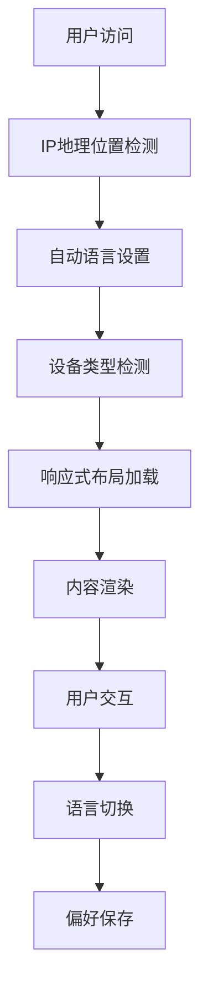

# Jekyll博客综合优化方案

## 1. 项目概述

本文档针对KannmuSite Jekyll博客项目提出综合优化方案，旨在提升用户体验、增强多语言功能、优化响应式设计，并清理不必要的内容。项目当前使用Jekyll + Bootstrap 3.x + jQuery技术栈，托管在GitHub Pages上。

## 2. 核心功能

### 2.1 用户角色
本项目为个人博客，无需复杂的用户角色区分：

| 角色 | 访问方式 | 核心权限 |
|------|----------|----------|
| 访客 | 直接访问 | 浏览文章、切换语言、搜索内容 |
| 博主 | 后台管理 | 发布文章、管理内容、配置设置 |

### 2.2 功能模块

优化后的博客包含以下核心页面：
1. **首页**：文章列表、多语言选择器、响应式导航栏
2. **文章详情页**：文章内容、评论系统、相关推荐
3. **关于页面**：个人介绍、联系方式、作品集链接
4. **归档页面**：按时间/标签分类的文章列表
5. **搜索页面**：全文搜索功能、搜索结果展示

### 2.3 页面详情

| 页面名称 | 模块名称 | 功能描述 |
|----------|----------|----------|
| 首页 | 导航栏 | 响应式导航、多语言选择器、搜索入口 |
| 首页 | 文章列表 | 分页显示、摘要预览、发布时间 |
| 首页 | 侧边栏 | 标签云、友链、个人简介 |
| 文章详情页 | 文章内容 | Markdown渲染、代码高亮、数学公式支持 |
| 文章详情页 | 多语言支持 | 自动语言检测、手动切换、内容翻译 |
| 关于页面 | 个人介绍 | 多语言版本、响应式布局 |
| 归档页面 | 文章分类 | 按时间线排序、标签筛选 |
| 搜索页面 | 搜索功能 | 实时搜索、结果高亮、搜索建议 |

## 3. 核心流程

### 3.1 用户访问流程
用户访问博客时，系统首先检测用户IP地址确定地理位置，自动设置对应语言。用户可通过导航栏的语言选择器手动切换语言，系统会记住用户偏好并在后续访问中应用。

### 3.2 响应式适配流程
系统根据设备屏幕尺寸自动调整布局：桌面端显示完整侧边栏，平板端收缩部分内容，移动端采用折叠式导航和单列布局。



## 4. 用户界面设计

### 4.1 设计风格
- **主色调**：深蓝色(#337ab7)、白色(#ffffff)
- **辅助色**：灰色(#777777)、浅灰色(#f5f5f5)
- **按钮样式**：圆角设计、悬停效果、渐变背景
- **字体**：中文使用微软雅黑，英文使用Helvetica Neue
- **布局风格**：卡片式设计、顶部固定导航
- **图标风格**：Font Awesome图标库、SVG国旗图标

### 4.2 页面设计概览

| 页面名称 | 模块名称 | UI元素 |
|----------|----------|--------|
| 导航栏 | 多语言选择器 | 下拉菜单、国旗图标、平滑动画、响应式设计 |
| 导航栏 | 搜索功能 | 搜索图标、展开式搜索框、实时建议 |
| 首页 | 文章卡片 | 阴影效果、悬停动画、标签标识、阅读时间 |
| 侧边栏 | 标签云 | 彩色标签、大小权重、点击效果 |
| 文章页 | 目录导航 | 固定位置、滚动高亮、平滑跳转 |

### 4.3 响应式设计
- **桌面优先**：基础设计针对1200px+屏幕
- **平板适配**：768px-1199px使用中等布局
- **移动适配**：<768px采用单列布局
- **触摸优化**：增大点击区域、优化手势操作

## 5. 技术实现方案

### 5.1 多语言功能完善

#### 5.1.1 IP地址自动语言检测
```javascript
// IP地理位置检测实现
class LanguageDetector {
    constructor() {
        this.apiEndpoints = [
            'https://ipapi.co/json/',
            'https://ipinfo.io/json',
            'https://api.ipgeolocation.io/ipgeo?apiKey=YOUR_KEY'
        ];
        this.languageMap = {
            'CN': 'chinese_simplified',
            'TW': 'chinese_traditional', 
            'HK': 'chinese_traditional',
            'US': 'english',
            'GB': 'english',
            'FR': 'french',
            'DE': 'german',
            'JP': 'japanese',
            'KR': 'korean',
            'ES': 'spanish',
            'RU': 'russian'
        };
    }

    async detectLanguage() {
        // 检查本地存储的用户偏好
        const savedLang = localStorage.getItem('preferred_language');
        if (savedLang) return savedLang;

        // IP检测降级策略
        for (const endpoint of this.apiEndpoints) {
            try {
                const response = await fetch(endpoint);
                const data = await response.json();
                const countryCode = data.country_code || data.country;
                return this.languageMap[countryCode] || 'english';
            } catch (error) {
                console.warn(`IP检测失败: ${endpoint}`, error);
            }
        }

        // 浏览器语言备选方案
        const browserLang = navigator.language.toLowerCase();
        if (browserLang.includes('zh-cn')) return 'chinese_simplified';
        if (browserLang.includes('zh-tw')) return 'chinese_traditional';
        if (browserLang.includes('ja')) return 'japanese';
        if (browserLang.includes('ko')) return 'korean';
        if (browserLang.includes('fr')) return 'french';
        if (browserLang.includes('de')) return 'german';
        if (browserLang.includes('es')) return 'spanish';
        if (browserLang.includes('ru')) return 'russian';
        
        return 'english'; // 默认语言
    }
}
```

#### 5.1.2 优化语言选择器UI
```html
<!-- 新的多语言选择器设计 -->
<div class="language-selector-container">
    <div class="language-selector" id="languageSelector">
        <button class="language-btn" id="currentLanguage">
            <span class="flag-icon" id="currentFlag">🇺🇸</span>
            <span class="language-text" id="currentLangText">English</span>
            <i class="fa fa-chevron-down"></i>
        </button>
        <div class="language-dropdown" id="languageDropdown">
            <div class="language-option" data-lang="english" data-flag="🇺🇸">
                <span class="flag-icon">🇺🇸</span>
                <span class="language-name">English</span>
            </div>
            <div class="language-option" data-lang="chinese_simplified" data-flag="🇨🇳">
                <span class="flag-icon">🇨🇳</span>
                <span class="language-name">简体中文</span>
            </div>
            <div class="language-option" data-lang="chinese_traditional" data-flag="🇹🇼">
                <span class="flag-icon">🇹🇼</span>
                <span class="language-name">繁體中文</span>
            </div>
            <div class="language-option" data-lang="japanese" data-flag="🇯🇵">
                <span class="flag-icon">🇯🇵</span>
                <span class="language-name">日本語</span>
            </div>
            <div class="language-option" data-lang="french" data-flag="🇫🇷">
                <span class="flag-icon">🇫🇷</span>
                <span class="language-name">Français</span>
            </div>
            <div class="language-option" data-lang="spanish" data-flag="🇪🇸">
                <span class="flag-icon">🇪🇸</span>
                <span class="language-name">Español</span>
            </div>
            <div class="language-option" data-lang="russian" data-flag="🇷🇺">
                <span class="flag-icon">🇷🇺</span>
                <span class="language-name">Русский</span>
            </div>
        </div>
    </div>
</div>
```

#### 5.1.3 CSS样式优化
```css
/* 多语言选择器样式 */
.language-selector-container {
    position: relative;
    display: inline-block;
    margin-left: 15px;
}

.language-selector {
    position: relative;
    z-index: 1000;
}

.language-btn {
    display: flex;
    align-items: center;
    padding: 8px 12px;
    background: rgba(255, 255, 255, 0.1);
    border: 1px solid rgba(255, 255, 255, 0.3);
    border-radius: 6px;
    color: #fff;
    cursor: pointer;
    transition: all 0.3s ease;
    font-size: 14px;
    min-width: 120px;
}

.language-btn:hover {
    background: rgba(255, 255, 255, 0.2);
    border-color: rgba(255, 255, 255, 0.5);
    transform: translateY(-1px);
}

.flag-icon {
    font-size: 16px;
    margin-right: 8px;
}

.language-text {
    flex: 1;
    text-align: left;
}

.language-dropdown {
    position: absolute;
    top: 100%;
    left: 0;
    right: 0;
    background: #fff;
    border: 1px solid #ddd;
    border-radius: 6px;
    box-shadow: 0 4px 12px rgba(0, 0, 0, 0.15);
    opacity: 0;
    visibility: hidden;
    transform: translateY(-10px);
    transition: all 0.3s ease;
    z-index: 1001;
    max-height: 300px;
    overflow-y: auto;
}

.language-dropdown.show {
    opacity: 1;
    visibility: visible;
    transform: translateY(0);
}

.language-option {
    display: flex;
    align-items: center;
    padding: 10px 12px;
    cursor: pointer;
    transition: background-color 0.2s ease;
    color: #333;
}

.language-option:hover {
    background-color: #f8f9fa;
}

.language-option.active {
    background-color: #e3f2fd;
    color: #1976d2;
}

.language-name {
    margin-left: 8px;
    font-size: 14px;
}

/* 响应式设计 */
@media (max-width: 768px) {
    .language-btn {
        min-width: 100px;
        padding: 6px 10px;
        font-size: 13px;
    }
    
    .language-text {
        display: none;
    }
    
    .flag-icon {
        margin-right: 4px;
    }
}

/* 深色模式支持 */
@media (prefers-color-scheme: dark) {
    .language-dropdown {
        background: #2d3748;
        border-color: #4a5568;
        color: #e2e8f0;
    }
    
    .language-option {
        color: #e2e8f0;
    }
    
    .language-option:hover {
        background-color: #4a5568;
    }
    
    .language-option.active {
        background-color: #3182ce;
        color: #fff;
    }
}

/* 高对比度模式 */
@media (prefers-contrast: high) {
    .language-btn {
        border-width: 2px;
    }
    
    .language-dropdown {
        border-width: 2px;
    }
}

/* 减少动画模式 */
@media (prefers-reduced-motion: reduce) {
    .language-btn,
    .language-dropdown,
    .language-option {
        transition: none;
    }
}
```

### 5.2 响应式设计优化

#### 5.2.1 CSS Grid和Flexbox布局
```css
/* 主容器响应式布局 */
.main-container {
    display: grid;
    grid-template-columns: 1fr 300px;
    gap: 30px;
    max-width: 1200px;
    margin: 0 auto;
    padding: 0 20px;
}

/* 平板布局 */
@media (max-width: 1024px) {
    .main-container {
        grid-template-columns: 1fr 250px;
        gap: 20px;
    }
}

/* 移动端布局 */
@media (max-width: 768px) {
    .main-container {
        grid-template-columns: 1fr;
        gap: 15px;
        padding: 0 15px;
    }
    
    .sidebar {
        order: -1; /* 侧边栏移到顶部 */
    }
}

/* 导航栏响应式 */
.navbar {
    display: flex;
    justify-content: space-between;
    align-items: center;
    padding: 0 20px;
    height: 60px;
}

.navbar-nav {
    display: flex;
    list-style: none;
    margin: 0;
    padding: 0;
}

.navbar-nav li {
    margin-left: 20px;
}

/* 移动端导航 */
@media (max-width: 768px) {
    .navbar-nav {
        position: fixed;
        top: 60px;
        left: -100%;
        width: 100%;
        height: calc(100vh - 60px);
        background: #fff;
        flex-direction: column;
        justify-content: flex-start;
        align-items: center;
        padding-top: 50px;
        transition: left 0.3s ease;
        z-index: 999;
    }
    
    .navbar-nav.active {
        left: 0;
    }
    
    .navbar-nav li {
        margin: 10px 0;
    }
    
    .navbar-toggle {
        display: block;
        background: none;
        border: none;
        font-size: 24px;
        cursor: pointer;
    }
}

@media (min-width: 769px) {
    .navbar-toggle {
        display: none;
    }
}
```

#### 5.2.2 图片和媒体响应式处理
```css
/* 响应式图片 */
.responsive-img {
    max-width: 100%;
    height: auto;
    border-radius: 8px;
    box-shadow: 0 2px 8px rgba(0, 0, 0, 0.1);
}

/* 响应式iframe */
.responsive-iframe-container {
    position: relative;
    width: 100%;
    height: 0;
    padding-bottom: 56.25%; /* 16:9 宽高比 */
    overflow: hidden;
    border-radius: 8px;
}

.responsive-iframe {
    position: absolute;
    top: 0;
    left: 0;
    width: 100%;
    height: 100%;
    border: none;
}

/* 视频响应式 */
.video-container {
    position: relative;
    width: 100%;
    max-width: 800px;
    margin: 20px auto;
}

.video-container video {
    width: 100%;
    height: auto;
    border-radius: 8px;
}
```

#### 5.2.3 JavaScript响应式处理
```javascript
// 响应式处理类
class ResponsiveHandler {
    constructor() {
        this.breakpoints = {
            mobile: 768,
            tablet: 1024,
            desktop: 1200
        };
        this.init();
    }

    init() {
        this.handleResize();
        window.addEventListener('resize', this.debounce(this.handleResize.bind(this), 250));
        window.addEventListener('orientationchange', this.handleOrientationChange.bind(this));
    }

    handleResize() {
        const width = window.innerWidth;
        
        if (width <= this.breakpoints.mobile) {
            this.setMobileLayout();
        } else if (width <= this.breakpoints.tablet) {
            this.setTabletLayout();
        } else {
            this.setDesktopLayout();
        }
        
        this.adjustIframes();
        this.optimizeImages();
    }

    setMobileLayout() {
        document.body.classList.add('mobile-layout');
        document.body.classList.remove('tablet-layout', 'desktop-layout');
        
        // 移动端特定优化
        this.collapseSidebar();
        this.enableTouchNavigation();
    }

    setTabletLayout() {
        document.body.classList.add('tablet-layout');
        document.body.classList.remove('mobile-layout', 'desktop-layout');
    }

    setDesktopLayout() {
        document.body.classList.add('desktop-layout');
        document.body.classList.remove('mobile-layout', 'tablet-layout');
        
        // 桌面端特定优化
        this.expandSidebar();
        this.enableKeyboardNavigation();
    }

    adjustIframes() {
        const iframes = document.querySelectorAll('iframe');
        iframes.forEach(iframe => {
            if (!iframe.closest('.responsive-iframe-container')) {
                this.wrapIframe(iframe);
            }
        });
    }

    wrapIframe(iframe) {
        const wrapper = document.createElement('div');
        wrapper.className = 'responsive-iframe-container';
        iframe.parentNode.insertBefore(wrapper, iframe);
        wrapper.appendChild(iframe);
        iframe.className += ' responsive-iframe';
    }

    optimizeImages() {
        const images = document.querySelectorAll('img:not(.optimized)');
        images.forEach(img => {
            img.classList.add('responsive-img', 'optimized');
            
            // 懒加载实现
            if ('IntersectionObserver' in window) {
                this.lazyLoadImage(img);
            }
        });
    }

    lazyLoadImage(img) {
        const observer = new IntersectionObserver((entries) => {
            entries.forEach(entry => {
                if (entry.isIntersecting) {
                    const image = entry.target;
                    if (image.dataset.src) {
                        image.src = image.dataset.src;
                        image.removeAttribute('data-src');
                    }
                    observer.unobserve(image);
                }
            });
        });
        
        observer.observe(img);
    }

    handleOrientationChange() {
        // 延迟处理，等待设备完成旋转
        setTimeout(() => {
            this.handleResize();
        }, 100);
    }

    debounce(func, wait) {
        let timeout;
        return function executedFunction(...args) {
            const later = () => {
                clearTimeout(timeout);
                func(...args);
            };
            clearTimeout(timeout);
            timeout = setTimeout(later, wait);
        };
    }

    collapseSidebar() {
        const sidebar = document.querySelector('.sidebar');
        if (sidebar) {
            sidebar.classList.add('collapsed');
        }
    }

    expandSidebar() {
        const sidebar = document.querySelector('.sidebar');
        if (sidebar) {
            sidebar.classList.remove('collapsed');
        }
    }

    enableTouchNavigation() {
        // 触摸导航优化
        const navItems = document.querySelectorAll('.nav-item');
        navItems.forEach(item => {
            item.style.minHeight = '44px'; // iOS推荐的最小触摸目标
            item.style.padding = '12px 16px';
        });
    }

    enableKeyboardNavigation() {
        // 键盘导航优化
        const focusableElements = document.querySelectorAll(
            'a, button, input, textarea, select, [tabindex]:not([tabindex="-1"])'
        );
        
        focusableElements.forEach(element => {
            element.addEventListener('focus', this.handleFocus);
            element.addEventListener('blur', this.handleBlur);
        });
    }

    handleFocus(event) {
        event.target.classList.add('keyboard-focus');
    }

    handleBlur(event) {
        event.target.classList.remove('keyboard-focus');
    }
}

// 初始化响应式处理
document.addEventListener('DOMContentLoaded', () => {
    new ResponsiveHandler();
});
```

### 5.3 A Dark Room内容移除方案

#### 5.3.1 文件删除清单
```bash
# 需要删除的文件和文件夹
/docs/adarkroom/                    # 整个游戏文件夹
/docs/_site/adarkroom/              # 构建生成的游戏文件夹
```

#### 5.3.2 代码引用清理
需要从以下文件中移除A Dark Room相关链接：

1. **_layouts/page.html** (第47行)
```html
<!-- 移除这行 -->
<a href = "./adarkroom/"> A Dark Room </a>
```

2. **检查其他可能的引用**
```bash
# 搜索所有可能的引用
grep -r "adarkroom\|A Dark Room" docs/ --exclude-dir=adarkroom --exclude-dir=_site
```

#### 5.3.3 清理脚本
```bash
#!/bin/bash
# 清理A Dark Room相关内容的脚本

echo "开始清理A Dark Room相关内容..."

# 删除游戏文件夹
if [ -d "docs/adarkroom" ]; then
    rm -rf docs/adarkroom
    echo "已删除 docs/adarkroom 文件夹"
fi

if [ -d "docs/_site/adarkroom" ]; then
    rm -rf docs/_site/adarkroom
    echo "已删除 docs/_site/adarkroom 文件夹"
fi

# 从页面模板中移除链接
sed -i '' '/adarkroom/d' docs/_layouts/page.html
echo "已从页面模板中移除A Dark Room链接"

# 检查是否还有其他引用
echo "检查剩余引用..."
grep -r "adarkroom\|A Dark Room" docs/ --exclude-dir=_site || echo "未发现其他引用"

echo "清理完成！"
```

### 5.4 其他项目问题分析与优化

#### 5.4.1 性能优化

**CSS优化**
```css
/* 关键CSS内联 */
.critical-css {
    /* 首屏必需的样式 */
    font-family: -apple-system, BlinkMacSystemFont, 'Segoe UI', Roboto, sans-serif;
    line-height: 1.6;
    color: #333;
}

/* 非关键CSS延迟加载 */
.non-critical {
    /* 非首屏样式 */
}
```

**JavaScript优化**
```javascript
// 代码分割和懒加载
const loadModule = async (moduleName) => {
    try {
        const module = await import(`./modules/${moduleName}.js`);
        return module.default;
    } catch (error) {
        console.error(`Failed to load module: ${moduleName}`, error);
    }
};

// 防抖和节流
const debounce = (func, delay) => {
    let timeoutId;
    return (...args) => {
        clearTimeout(timeoutId);
        timeoutId = setTimeout(() => func.apply(null, args), delay);
    };
};

const throttle = (func, limit) => {
    let inThrottle;
    return function() {
        const args = arguments;
        const context = this;
        if (!inThrottle) {
            func.apply(context, args);
            inThrottle = true;
            setTimeout(() => inThrottle = false, limit);
        }
    }
};
```

#### 5.4.2 SEO优化
```html
<!-- 改进的meta标签 -->
<meta charset="UTF-8">
<meta name="viewport" content="width=device-width, initial-scale=1.0">
<meta name="description" content="{{ page.description | default: site.description }}">
<meta name="keywords" content="{{ page.tags | join: ', ' }}">
<meta name="author" content="{{ site.author }}">

<!-- Open Graph标签 -->
<meta property="og:title" content="{{ page.title | default: site.title }}">
<meta property="og:description" content="{{ page.description | default: site.description }}">
<meta property="og:image" content="{{ page.image | default: site.default_image }}">
<meta property="og:url" content="{{ page.url | absolute_url }}">
<meta property="og:type" content="article">

<!-- Twitter Card -->
<meta name="twitter:card" content="summary_large_image">
<meta name="twitter:title" content="{{ page.title | default: site.title }}">
<meta name="twitter:description" content="{{ page.description | default: site.description }}">
<meta name="twitter:image" content="{{ page.image | default: site.default_image }}">

<!-- 结构化数据 -->
<script type="application/ld+json">
{
  "@context": "https://schema.org",
  "@type": "BlogPosting",
  "headline": "{{ page.title }}",
  "description": "{{ page.description }}",
  "author": {
    "@type": "Person",
    "name": "{{ site.author }}"
  },
  "datePublished": "{{ page.date | date_to_xmlschema }}",
  "dateModified": "{{ page.last_modified_at | default: page.date | date_to_xmlschema }}",
  "image": "{{ page.image | default: site.default_image }}",
  "url": "{{ page.url | absolute_url }}"
}
</script>
```

#### 5.4.3 无障碍性改进
```html
<!-- 改进的导航结构 -->
<nav role="navigation" aria-label="主导航">
    <ul class="nav-list">
        <li><a href="/" aria-current="page">首页</a></li>
        <li><a href="/about">关于</a></li>
        <li><a href="/archive">归档</a></li>
    </ul>
</nav>

<!-- 跳转链接 -->
<a href="#main-content" class="skip-link">跳转到主内容</a>

<!-- 改进的表单 -->
<form role="search" aria-label="站内搜索">
    <label for="search-input" class="sr-only">搜索关键词</label>
    <input type="search" id="search-input" placeholder="搜索文章..." aria-describedby="search-help">
    <div id="search-help" class="sr-only">输入关键词搜索站内文章</div>
    <button type="submit" aria-label="执行搜索">
        <i class="fa fa-search" aria-hidden="true"></i>
    </button>
</form>
```

```css
/* 无障碍性样式 */
.sr-only {
    position: absolute;
    width: 1px;
    height: 1px;
    padding: 0;
    margin: -1px;
    overflow: hidden;
    clip: rect(0, 0, 0, 0);
    white-space: nowrap;
    border: 0;
}

.skip-link {
    position: absolute;
    top: -40px;
    left: 6px;
    background: #000;
    color: #fff;
    padding: 8px;
    text-decoration: none;
    z-index: 1000;
}

.skip-link:focus {
    top: 6px;
}

/* 焦点指示器 */
:focus {
    outline: 2px solid #005fcc;
    outline-offset: 2px;
}

/* 高对比度模式 */
@media (prefers-contrast: high) {
    :root {
        --text-color: #000;
        --bg-color: #fff;
        --link-color: #0000ee;
        --visited-color: #551a8b;
    }
}

/* 减少动画 */
@media (prefers-reduced-motion: reduce) {
    * {
        animation-duration: 0.01ms !important;
        animation-iteration-count: 1 !important;
        transition-duration: 0.01ms !important;
    }
}
```

#### 5.4.4 错误处理和监控
```javascript
// 全局错误处理
class ErrorHandler {
    constructor() {
        this.init();
    }

    init() {
        // JavaScript错误捕获
        window.addEventListener('error', this.handleError.bind(this));
        window.addEventListener('unhandledrejection', this.handlePromiseRejection.bind(this));
        
        // 资源加载错误
        document.addEventListener('error', this.handleResourceError.bind(this), true);
    }

    handleError(event) {
        console.error('JavaScript Error:', {
            message: event.message,
            filename: event.filename,
            lineno: event.lineno,
            colno: event.colno,
            error: event.error
        });
        
        this.showUserFriendlyError('页面出现了一些问题，请刷新页面重试。');
    }

    handlePromiseRejection(event) {
        console.error('Unhandled Promise Rejection:', event.reason);
        this.showUserFriendlyError('操作失败，请稍后重试。');
    }

    handleResourceError(event) {
        const target = event.target;
        if (target.tagName === 'IMG') {
            this.handleImageError(target);
        } else if (target.tagName === 'SCRIPT') {
            this.handleScriptError(target);
        } else if (target.tagName === 'LINK') {
            this.handleStyleError(target);
        }
    }

    handleImageError(img) {
        // 图片加载失败处理
        img.src = '/img/placeholder.png';
        img.alt = '图片加载失败';
    }

    handleScriptError(script) {
        // 脚本加载失败处理
        console.warn('Script failed to load:', script.src);
    }

    handleStyleError(link) {
        // 样式表加载失败处理
        console.warn('Stylesheet failed to load:', link.href);
    }

    showUserFriendlyError(message) {
        // 显示用户友好的错误提示
        const toast = document.createElement('div');
        toast.className = 'error-toast';
        toast.textContent = message;
        document.body.appendChild(toast);
        
        setTimeout(() => {
            toast.remove();
        }, 5000);
    }
}

// 初始化错误处理
new ErrorHandler();
```

## 6. 实施计划

### 6.1 第一阶段：基础清理和准备（1-2天）
1. 删除A Dark Room相关文件和链接
2. 备份现有配置和重要文件
3. 更新项目依赖和构建工具

### 6.2 第二阶段：多语言功能实现（3-4天）
1. 实现IP地理位置检测功能
2. 重新设计语言选择器UI
3. 优化语言切换逻辑和用户体验
4. 测试各种语言和地区的兼容性

### 6.3 第三阶段：响应式设计优化（3-4天）
1. 重构CSS布局系统
2. 实现JavaScript响应式处理
3. 优化移动端交互体验
4. 测试各种设备和屏幕尺寸

### 6.4 第四阶段：性能和质量优化（2-3天）
1. 实施性能优化措施
2. 改进SEO和无障碍性
3. 添加错误处理和监控
4. 全面测试和调试

### 6.5 第五阶段：部署和验证（1天）
1. 部署到GitHub Pages
2. 验证所有功能正常工作
3. 性能测试和优化调整
4. 文档更新和项目总结

## 7. 测试策略

### 7.1 功能测试
- 多语言切换功能测试
- 响应式布局测试
- 搜索功能测试
- 导航和链接测试

### 7.2 兼容性测试
- 浏览器兼容性（Chrome, Firefox, Safari, Edge）
- 设备兼容性（桌面、平板、手机）
- 操作系统兼容性（Windows, macOS, iOS, Android）

### 7.3 性能测试
- 页面加载速度测试
- 资源优化效果测试
- 移动端性能测试

### 7.4 无障碍性测试
- 键盘导航测试
- 屏幕阅读器兼容性测试
- 色彩对比度测试

## 8. 维护和监控

### 8.1 定期维护
- 依赖包更新
- 安全补丁应用
- 性能监控和优化
- 内容备份和恢复

### 8.2 用户反馈
- 建立用户反馈渠道
- 定期收集和分析用户体验数据
- 根据反馈持续改进功能

### 8.3 技术债务管理
- 代码质量监控
- 技术栈升级计划
- 重构和优化计划

通过以上综合优化方案的实施，KannmuSite博客将获得更好的用户体验、更强的多语言支持、更优的响应式设计，以及更高的代码质量和系统稳定性。